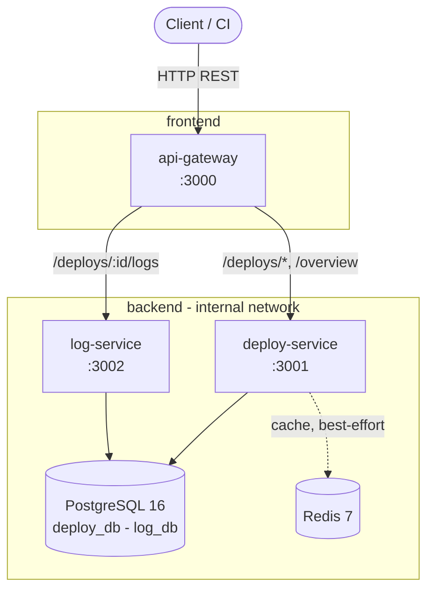

# Architecture — Deploy Status Checker

See [DOP-001](https://app.notion.com/p/3cfb4aef823981edb9b9e6e434231dbe) for the full design. This diagram matches DOP-001 §4.

- Only `api-gateway` is reachable from outside the `backend` network.
- `deploy-service` and `log-service` never call each other directly.
- `deploy-service` owns `deploy_db`; `log-service` owns `log_db` — no cross-service database access.
- Redis is a cache only; every read path still works with Redis stopped (falls back to PostgreSQL).

Stack versions (locked, see DOP-001 §4): TypeScript / Node.js 24 / Express 5 / Prisma 6, PostgreSQL 16, Redis 7.
