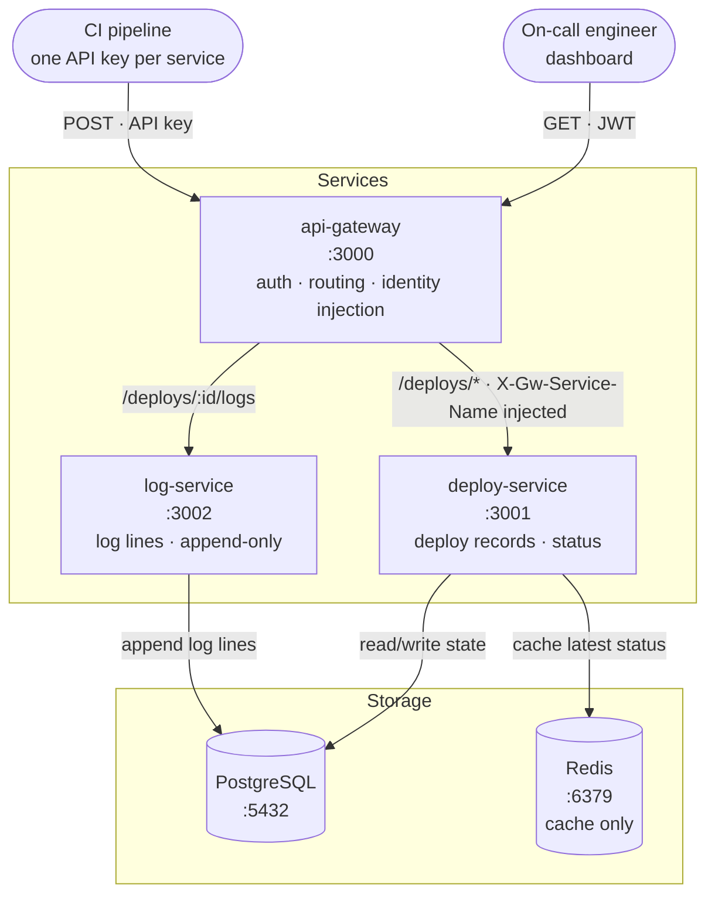

# Architecture — Deploy Status Checker

> **Status: design settled at Q2 (Day 9).** Service boundaries, identity model and the push-only
> ingestion model are decided. Remaining open items are listed at the bottom and are resolved in
> Q3–Q5 before the IRDs are written.

## Primary user

**On-call engineer during an incident.** The question the whole system exists to answer:

> *"Were there any deployments to production in the last 10 minutes?"*

Every design decision below is judged against whether it makes that question faster to answer.

## System diagram

Solid arrows are synchronous HTTP. There are **no dashed arrows** — see settled decision 3: this
system has no asynchronous workload, therefore no queue.

## Settled decisions

| # | Decision | Recorded in |
|---|---|---|
| 1 | **Ingestion is push-only.** CI reports every deploy event. The system never probes running services. Pull-based runtime reconciliation is a Non-goal for Sprint 1. | DOP-001 Non-goals · IRD-003 |
| 2 | **`log-service` stores real log content** — append-only log lines, its own retention. This is what justifies it as a separate service: thousands of text rows streaming in is a different write pattern from updating one status row. | IRD-002 |
| 3 | **`log_url` also lives on the deploy record**, pointing back to the original CI run so the on-call engineer can jump to the full pipeline UI. Complements decision 2, does not replace it. | IRD-001 |
| 4 | **No queue.** No workload in this system is genuinely asynchronous. Redis is cache-only. Stating this explicitly is deliberate — a queue added without a measurable reason is over-engineering. | IRD-003 |
| 5 | **`environment` is a strict enum** — `production`, `staging`, `testing`, `development`. Free-text is rejected at the API with `400`, so `prod` never becomes a second spelling of `production`. | IRD-001 |
| 6 | **No service registry table.** Service identity is derived from the API key: the gateway maps one key to one canonical service name and injects it downstream. CI cannot name itself in the request body. | IRD-003 |
| 7 | **No role-based access control.** Read-only dashboard serves all human users identically. Team lead and QA views are Non-goals for Sprint 1. | DOP-001 Non-goals |
| 8 | **`status` enum must include `ROLLED_BACK`.** Without it the on-call engineer cannot tell a successful deploy from one that was rolled back — the single case they most need to see. | IRD-001 |
| 9 | **Rollback is a two-step protocol, both steps required.** `PATCH` the failed deploy to `ROLLED_BACK`, then `POST` a new deploy for the restored version carrying `rolled_back_from`. Recording only one step leaves half a picture. Crucially, the rollback `POST` needs its **own** idempotency key (`<run_id>-rollback-<n>`) — reusing the original run id makes `UNIQUE (service, environment, ci_run_id)` silently reject the very record on-call needs. This protocol is also the only one that makes `/overview` answer *what is running now* rather than *what just failed*. | DOP-001 AC-11 + IRD-001 |
| 10 | **No authentication service.** Nothing here issues a JWT — no `user-service`, no user table; the gateway only verifies. Sprint 1 mints tokens manually with the shared secret. Building auth would consume the sprint without advancing a single acceptance criterion. | DOP-001 Non-goals + IRD-003 |
| 11 | **`GET /deploys` is cursor-paginated.** `limit` alone silently truncates a window holding more rows than the cap — and silent truncation is the exact failure this product exists to eliminate. The cursor is composite (`started_at` + `id`) because `started_at` is not unique. | IRD-001 |

## Service ownership

| Service | Owns | Does NOT own |
|---|---|---|
| `api-gateway` | Routing, JWT + API-key validation, **service-identity mapping (configuration, not data)**, stripping spoofed identity headers | Any persistent data |
| `deploy-service` | Deploy records, status transitions, `environment`, `log_url`, latest-status cache | Log content |
| `log-service` | Append-only log lines, log retention | Deploy status, identity, users |

## Decision log — Q3 to Q5 (all closed)

| # | Question | Where it lands |
|---|---|---|
| A | ~~One instance or two?~~ **RESOLVED Q4, revised Day 9.** One PostgreSQL instance holding **two separate databases** — `deploy_db` and `log_db` — each with its own least-privilege user and `CONNECT` revoked on the other. Chosen over schema-per-service because schemas rely on `GRANT`, and a dev superuser connection string bypasses `GRANT`; **PostgreSQL cannot join across databases at all**, superuser included, so the no-cross-service-join rule stops being discipline and becomes physics. Cost of the stronger guarantee: zero — still one container, one volume, one healthcheck. Two separate instances would additionally isolate failure domain, resources and tuning (what production does) but cost a second container and ~200-400 MB RAM to solve a noisy-neighbour problem that cannot yet be measured; revisit at Week 3 where two StatefulSets are normal. | IRD-003 |
| B | ~~Header name + strip rule~~ **RESOLVED Q5.** All injected headers use the `X-Gw-` prefix. The gateway strips every inbound `X-Gw-*` header **by prefix, never by an enumerated list** — a list goes stale the day a new injected header is added, making it spoofable. The gateway also strips the credential itself before forwarding. | IRD-003 |
| C | ~~What does Redis cache?~~ **RESOLVED Q3.** Not the rolling time-window query — every request carries a different `since`, so the cache key always misses. Redis caches the projection **latest deploy per (service, environment)**: a small bounded key set, read constantly by the dashboard, invalidated on deploy create and on status change. | IRD-003 |
| D | ~~Does log-service validate deploy_id?~~ **RESOLVED Q3.** No. Validating would mean a synchronous call to `deploy-service` on the hottest write path — latency and coupling for little gain. Orphan log rows are tolerated and cleaned by a periodic job. | IRD-002 |
| E | ~~How is the service list produced?~~ **RESOLVED Q5.** Not `SELECT DISTINCT`. A `GET /overview` endpoint returns the latest deploy per (service, environment) straight from the Redis projection — it is the dashboard landing page AND the service list, and it finally gives the cache a consumer. Must never 5xx when Redis is down: rebuild from `idx_deploys_service_env_started`. Redis is a cache, never a dependency. | IRD-001 + IRD-003 |
| F | ~~API-key rotation~~ **RESOLVED Q5 — Non-goal, documented.** Keys are static gateway config; rotation = edit config + redeploy. No revocation list, no expiry. Accepted risk; mitigation is that keys never leave CI secret storage. Revisit when the gateway gains a datastore. | IRD-003 |
| G | ~~Idempotency on POST /deploys~~ **RESOLVED — build it in Sprint 1.** `X-Idempotency-Key` is REQUIRED (missing → 400), stored as `ci_run_id`, enforced by `UNIQUE (service, environment, ci_run_id)`. A replay returns `200` with the existing record; a create returns `201`. Built now because the constraint is free on an empty table and a migration nightmare once duplicates exist. | IRD-001 |
| H | ~~Authorization on PATCH~~ **RESOLVED.** The UPDATE carries `AND service = <injected name>`. Rowcount 0 returns `404 DEPLOY_NOT_FOUND` — not `403`, which would leak that another service owns that id. One code path covers both cases. | IRD-001 |
| I | ~~Hard limits on the read path~~ **RESOLVED.** `since` required, window ≤ 7 days, `limit` default 50 / max 200. Violations return `400 VALIDATION_FAILED`. Prevents an unbounded `GET /deploys` degrading into a full table scan as the table grows. | IRD-001 |
| J | ~~updated_at maintenance~~ **RESOLVED Q5.** Handled by the ORM (Prisma `@updatedAt`), not a database trigger — a trigger is invisible behaviour, and with a single write path the risk of forgetting is negligible. Revisit if `deploys` gains a second write path. | IRD-001 |

## Known blind spot

Push-only ingestion means **any deploy that bypasses CI is invisible** — a manual deploy, an emergency
hotfix applied by hand. The on-call engineer would see nothing and conclude nothing changed, which is
the exact failure this system exists to prevent. Recorded as an assumption in DOP-001: the system
assumes all deploys go through CI. Closing this gap requires pull-based reconciliation (Non-goal, Sprint 2).

## Out of scope

- Full-text search over logs
- Log streaming / tailing
- Triggering deployments — this system **observes** deploys, it never performs them
- Role-based access control
