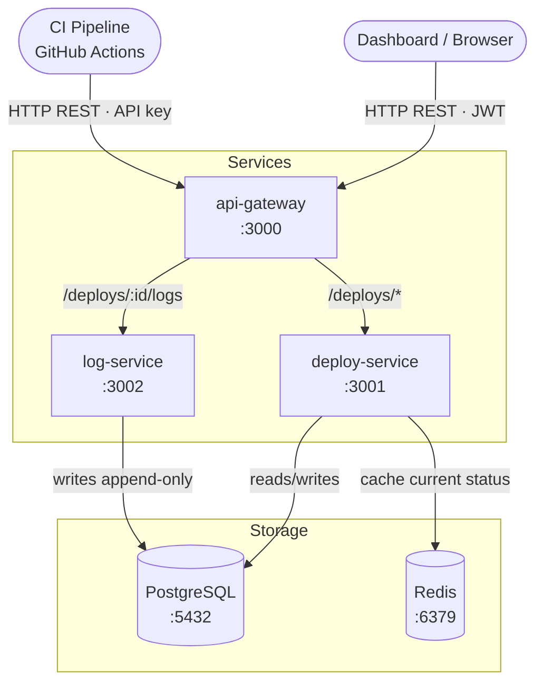

# Architecture — Deploy Status Checker

> **Status: DRAFT.** The service list and storage components below are settled (they come from the
> project definition). The items marked **CONFIRM** are design decisions that must be resolved in the
> discovery chain (Q3–Q6) and recorded in the IRDs before this diagram is final.

## System diagram

## How to read this

- **Solid arrows** — synchronous HTTP calls.
- **Dashed arrows** — asynchronous events through a queue. _None yet; see CONFIRM #3._
- **Cylinders** — storage components.
- **Two entry points** — humans authenticate with JWT, the CI pipeline with an API key. This is the
  design decision that replaces a public registration flow; see IRD-003.

## Decisions still to confirm

| # | Question | Where it gets recorded |
|---|---|---|
| 1 | Do `deploy-service` and `log-service` share one PostgreSQL instance with a schema each, or one instance per service? | IRD-003 |
| 2 | Does the gateway forward the caller identity downstream, and in what header? | IRD-003 |
| 3 | Is there any genuinely asynchronous workload? If not, **no queue** — Redis stays cache-only, and this must be stated explicitly in IRD-003. | IRD-003 |
| 4 | What exactly does Redis cache, with what TTL, invalidated when? If this cannot be written in three lines, drop Redis. | IRD-003 |
| 5 | Does `log-service` write to Postgres directly, or does `deploy-service` proxy the write? | IRD-002 |

## Service ownership

| Service | Owns | Does NOT own |
|---|---|---|
| `api-gateway` | Routing, authentication, request forwarding | Any persistent data |
| `deploy-service` | Deploy records, status transitions, current-state cache | Log content |
| `log-service` | Append-only log entries, retention | Deploy status, users |

## Out of scope

Recorded here so it stays out of the IRDs and out of Sprint 1:

- Full-text search over logs
- Log streaming / tailing
- Triggering deployments — this system **observes** deploys, it does not perform them
