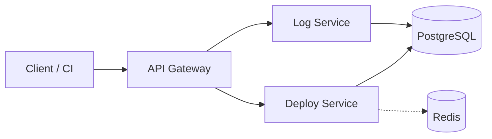

# DOP-001 — Deploy Status Checker

Local mirror of the Notion page (source of truth): https://app.notion.com/p/3cfb4aef823981edb9b9e6e434231dbe

## 1. Problem Statement

When an incident occurs or a release needs to be checked, the on-call engineer has to open CI/CD, the log service, dashboards, and chat in several different places to find out:
- which version is currently running;
- which environment it was deployed to;
- whether the deploy succeeded, failed, or was rolled back;
- where the related logs are.

## 2. Project Goal

Deploy Status Checker is a central place for CI, engineers, and on-call engineers to track deploy status, release version, environment, and related logs.

## 3. Core Features

- CI reports a deploy event (service, environment, version) when a deployment starts.
- The system tracks that deploy through its release flow — started → success/failed → rolled back.
- Engineers and on-call engineers can view deploy history and the latest status per service/environment.
- CI attaches logs to a deploy; engineers retrieve them, in order, to investigate a failure.

## 4. Primary Users

- CI System
- Engineer
- On-call Engineer
- Platform/DevOps Engineer

## 5. System Architecture

| Service | Responsibility | Language / Framework / Version | Port |
|---|---|---|---|
| API Gateway | Entry point, authentication, routing | TypeScript / Node.js 24 / Express 5 | 3000 |
| Deploy Service | Deployment status | TypeScript / Node.js 24 / Express 5 / Prisma 6 | 3001 |
| Log Service | Deployment logs | TypeScript / Node.js 24 / Express 5 / Prisma 6 | 3002 |
| PostgreSQL | Persistent data | PostgreSQL 16 | 5432 |
| Redis | Cache | Redis 7 | 6379 |

> This is the locked-in stack for the whole project — every Dockerfile, package.json, and docker-compose.yml must pin exactly these versions. Never use the `latest` tag.

- Clients and CI only call the API Gateway.
- API Gateway calls Deploy Service and Log Service.
- Deploy Service and Log Service never call each other directly.

## 6. VM Deployment

1. Provision the VM.
2. Install the correct Node.js version, system libraries, and dependencies.
3. Configure environment variables/secrets.
4. Run `npm ci`.
5. Run `npm run build`.
6. Run the service with systemd or PM2.
7. On a new release: pull/fetch the new version, rebuild, and restart.
8. On rollback: run the previous version again.

## 7. Docker Deployment

- Each microservice runs in its own container.
- Multi-stage Dockerfile.
- Non-root user.
- Image version/tag.
- Docker Hub or AWS ECR.
- Flow: build → tag → push → server pull → restart → health check → rollback.

| Action | Example |
|---|---|
| Build | `docker build -t <service>:<tag> .` |
| Tag | `docker tag <service>:<tag> <registry>/<service>:<tag>` |
| Push | `docker push <registry>/<service>:<tag>` |
| Pull | `docker compose pull <service>` |
| Restart | `docker compose up -d <service>` |
| Rollback | Switch back to the previous image tag, then `docker compose up -d <service>` |

## 8. Docker Compose and Container Networking

- API Gateway belongs to the `frontend` network; it is the only public container.
- API Gateway, Deploy Service, Log Service, PostgreSQL, and Redis belong to the `backend` (internal) network.
- Services call each other via Docker Compose service-name DNS, never IPs or localhost.
- `depends_on` is combined with health checks (`condition: service_healthy`), not just start order.
- Environment variables and secrets are loaded from `.env`, never hardcoded; named volumes are used for data that must survive container restarts.
- PostgreSQL uses a named volume so data isn't lost when the container is removed.
- Application containers (API Gateway, Deploy Service, Log Service) are stateless — they can be removed and recreated at any time without data loss.

## 9. Host Topology and High Availability

- Development: a single local host.
- Staging: a single VM.
- Production: two application hosts behind a load balancer.
- Each host runs all three services: API Gateway, Deploy Service, Log Service.
- If instance A fails its health check, the load balancer shifts traffic to B.
- When A recovers, it rejoins the pool.
- Docker Compose only manages containers within a single host; it does not provide multi-host HA on its own.
- The load balancer/orchestrator handles traffic across hosts, outside the scope of Docker Compose.

## 10. Database Reliability

- Deploy Service owns `deploy_db`; Log Service owns `log_db`.
- A single PostgreSQL container is not safe enough for production — a single point of failure that could lose both `deploy_db` and `log_db`.
- Team decision: use a **PostgreSQL primary/replica cluster** (one primary for writes, one or more replicas for reads and ready to be promoted if the primary fails) instead of a single container. Reason: avoids locking into one cloud provider's managed service, keeps failover under the team's control, and fits the current VM/Docker Compose deployment; when moving to AWS this can be swapped for managed PostgreSQL Multi-AZ without changing the application architecture.
- Regular backups, restore testing, and forward-only migrations are required.
- Redis is a cache only; a Redis failure must not bring the system down.

## 11. Acceptance Criteria

| ID | Given | When | Then |
|---|---|---|---|
| AC-01 | A new image version is pushed and tagged | it is deployed via `docker compose up -d <service>` | the service passes its health check within the configured retries and starts receiving traffic |
| AC-02 | A deployed service fails its health check | the failure persists past the retry threshold | the load balancer stops routing traffic to that instance |
| AC-03 | A production incident requires reverting a release | the team rolls back to the previous image tag and restarts the service | the service returns to a healthy state with no data loss |
| AC-04 | One of the two production application hosts goes down | the load balancer detects the failed health check | traffic keeps being served by the remaining host with no downtime for the client |
| AC-05 | The PostgreSQL primary fails | a replica is promoted | Deploy Service and Log Service resume read/write operations without manual data restoration |
| AC-06 | Redis becomes unavailable | Deploy Service reads deploy status | it falls back to PostgreSQL and keeps serving correct data |
| AC-07 | A CI run sends `POST /deploys` twice with the same `ci_run_id` | both requests are sent in sequence | only one record exists in `deploy_db` |
| AC-08 | A new production environment is being provisioned | the team reviews the deployment architecture | the database is configured as a primary/replica cluster, not a single PostgreSQL container |
| AC-09 | A backend service takes longer than the configured timeout to respond | the API Gateway is calling that service | the gateway returns 504 Gateway Timeout to the client within 1 second |
| AC-10 | The team reviews the log retention policy | the policy is documented and applied | logs are retained for at least 30 days and old logs are purged automatically (per IRD-002 §6) |

## 12. Definition of Done

| # | Criterion |
|---|---|
| 1 | Each service builds a Docker image from its multi-stage Dockerfile without errors |
| 2 | `docker compose up -d` brings up all services on the pinned stack versions (Node.js 24, Express 5, Prisma 6, PostgreSQL 16, Redis 7) with every health check passing |
| 3 | Services communicate only via service-name DNS inside the `backend` network; only API Gateway is reachable from `frontend` |
| 4 | The rollback procedure (previous tag + restart) has been exercised at least once and verified working |
| 5 | Database backup and restore have been tested at least once |
| 6 | Two-host + load balancer failover has been verified — killing one host does not interrupt client traffic |
| 7 | No secret or credential is hardcoded in any Dockerfile, compose file, or source file |
| 8 | A duplicate `POST /deploys` with the same `ci_run_id` does not create a second record (AC-07) |
| 9 | The API Gateway returns 504 within 1 second when an upstream service times out (AC-09) |
| 10 | A documented log retention policy is in force and has been verified by a test purge (AC-10) |

## 13. Non-Goals

- Executing deployments automatically — CI remains the trigger, this system only records and reports.
- Replacing the CI/CD tool itself.
- Hosting source code.
- Being a full monitoring/tracing/alerting platform.
- Multi-region active-active deployment.
- Auto-scaling (HPA/KEDA).
- Service mesh (Istio/Linkerd).
- Multi-cloud / cross-cloud failover.
- Canary or blue/green deployment strategies (we use rolling + manual rollback).

## 14. Success Metrics

| Metric | Target |
|---|---|
| Health check response time | < 500ms |
| Rollback time (previous tag → healthy) | < 2 minutes |
| Host failover time (load balancer detects + reroutes) | < 30 seconds |
| Database failover time (replica promotion) | < 5 minutes |
| Backup restore time (verified in a test run) | < 30 minutes |
| API Gateway p99 latency (all routes) | < 200ms |
| Log Service write throughput | > 100 logs/sec sustained |
| Cache miss / fallback to PostgreSQL latency (when Redis is down) | < 200ms p99 |

## 15. Functional Requirements

| ID | Requirement | IRD Reference |
|---|---|---|
| FR-1 | Each service is deployed as an independently versioned Docker container | IRD-003 §6 |
| FR-2 | Deploy Service records and exposes deploy status per service/environment | IRD-001 |
| FR-3 | Log Service stores and serves deployment logs, paginated | IRD-002 |
| FR-4 | API Gateway is the only public entry point, routes to backend services, and loads authentication configuration from environment variables | IRD-003 §3–§4, §6 |
| FR-5 | Production runs two application hosts behind a load balancer for HA | IRD-003 §6 |
| FR-6 | PostgreSQL runs as a primary/replica cluster, not a single container | DOP-001 §10 |
| FR-7 | `POST /deploys` is idempotent on `ci_run_id` | IRD-001 §1, AC-07 |
| FR-8 | API Gateway enforces a per-route upstream timeout and returns 504 on timeout | IRD-003 §3, AC-09 |
| FR-9 | Log retention is bounded by a documented policy and enforced automatically | IRD-002 §6, AC-10 |

## 16. Non-Functional Requirements

| ID | Requirement |
|---|---|
| NFR-1 | No secret or credential is hardcoded in any Dockerfile, compose file, or source file |
| NFR-2 | All application containers are stateless and can be recreated without data loss |
| NFR-3 | All images are pinned to explicit versions; the `latest` tag is never used |
| NFR-4 | Every service exposes a `/health` endpoint used by Compose health checks |
| NFR-5 | A Redis failure degrades gracefully (fallback to PostgreSQL) and never causes an outage |
