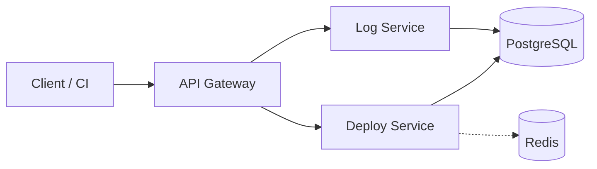

# DOP-001 — Deploy Status Checker

Source of truth: this local file (Notion page is stale — see `docs` repo history for the free-block-limit note that started this). Original Notion page (no longer updated): https://app.notion.com/p/3cfb4aef823981edb9b9e6e434231dbe

**2026-09-20 update:** §5, §9, §10, §16 revised and §17/§18 added to reflect the Kubernetes migration ("Day 15–17") that happened without a matching DOP update at the time — see §18 Version History.

## 1. Problem Statement

When an incident occurs or a release needs to be checked, the on-call engineer has to open CI/CD, the log service, dashboards, and chat in several different places to find out:
- which version is currently running;
- which environment it was deployed to;
- whether the deploy succeeded, failed, or was rolled back;
- where the related logs are.

## 2. Project Goal

Deploy Status Checker is a central place for CI, engineers, and on-call engineers to track deploy status, release version, environment, and related logs.

## 3. Core Features

- CI reports a deploy event (service, environment, version) when a deployment starts.
- The system tracks that deploy through its release flow — started → success/failed → rolled back.
- Engineers and on-call engineers can view deploy history and the latest status per service/environment.
- CI attaches logs to a deploy; engineers retrieve them, in order, to investigate a failure.

## 4. Primary Users

- CI System
- Engineer
- On-call Engineer
- Platform/DevOps Engineer

## 5. System Architecture

| Service | Responsibility | Language / Framework / Version | Port |
|---|---|---|---|
| API Gateway | Entry point, authentication, routing | TypeScript / Node.js 24 / Express 5 | 3000 |
| Deploy Service | Deployment status | TypeScript / Node.js 24 / Express 5 / Prisma 6 | 3001 |
| Log Service | Deployment logs | TypeScript / Node.js 24 / Express 5 / Prisma 6 | 3002 |
| PostgreSQL | Persistent data | PostgreSQL 18 | 5432 |
| Redis | Cache | Redis 8 | 6379 |

> This is the locked-in stack for the whole project — every Dockerfile, package.json, docker-compose.yml, **and Helm values file** must pin exactly these versions. Never use the `latest` tag.
>
> **2026-09-20:** PostgreSQL/Redis versions updated from 16/7 to **18/8** to match reality — the Kubernetes migration (§17) installed both via Bitnami Helm charts without pinning `image.tag`, which silently resolved to `latest` and pulled 18.6/8.10.2. Ratifying what's actually running rather than requiring a disruptive downgrade. **Not yet fixed:** the Helm values files (`infra/k8s/my-postgres-values.yaml`, `my-redis-values.yaml`) still don't pin `image.tag` explicitly, so a future `helm upgrade` can silently drift again — tracked in TIE-40.

- Clients and CI only call the API Gateway.
- API Gateway calls Deploy Service and Log Service.
- Deploy Service and Log Service never call each other directly.

## 6. VM Deployment

*(Reference/historical — superseded for staging and production by Kubernetes, §17. Kept because it still describes how `dev`-scale or bare-VM environments would work, and because §7's build→tag→push flow is shared with the Kubernetes path.)*

1. Provision the VM.
2. Install the correct Node.js version, system libraries, and dependencies.
3. Configure environment variables/secrets.
4. Run `npm ci`.
5. Run `npm run build`.
6. Run the service with systemd or PM2.
7. On a new release: pull/fetch the new version, rebuild, and restart.
8. On rollback: run the previous version again.

## 7. Docker Deployment

*(The build→tag→push flow below is shared by every deployment target, including Kubernetes — CI (IRD-007-to-be, TIE-20/21) produces the same registry image either way. "Pull → restart → rollback" is Compose-specific; the Kubernetes equivalent is `kubectl rollout` + the `migrator` Job pattern in §17.)*

- Each microservice runs in its own container.
- Multi-stage Dockerfile.
- Non-root user.
- Image version/tag.
- Docker Hub or AWS ECR.
- Flow: build → tag → push → server pull → restart → health check → rollback.

| Action | Example |
|---|---|
| Build | `docker build -t <service>:<tag> .` |
| Tag | `docker tag <service>:<tag> <registry>/<service>:<tag>` |
| Push | `docker push <registry>/<service>:<tag>` |
| Pull | `docker compose pull <service>` |
| Restart | `docker compose up -d <service>` |
| Rollback | Switch back to the previous image tag, then `docker compose up -d <service>` |

## 8. Docker Compose and Container Networking

*(This section now describes the **local development** target only. Staging and production run on Kubernetes — §17 — which achieves the same isolation goals (only the gateway is public; services reach each other by name; secrets aren't hardcoded) via Namespace + Service + Ingress + ConfigMap/Secret instead of Compose networks + `.env` files.)*

- API Gateway belongs to the `frontend` network; it is the only public container.
- API Gateway, Deploy Service, Log Service, PostgreSQL, and Redis belong to the `backend` (internal) network.
- Services call each other via Docker Compose service-name DNS, never IPs or localhost.
- `depends_on` is combined with health checks (`condition: service_healthy`), not just start order.
- Environment variables and secrets are loaded from `.env`, never hardcoded; named volumes are used for data that must survive container restarts.
- PostgreSQL uses a named volume so data isn't lost when the container is removed.
- Application containers (API Gateway, Deploy Service, Log Service) are stateless — they can be removed and recreated at any time without data loss.

## 9. Host Topology and High Availability

**2026-09-20: superseded by the Kubernetes migration (§17) for staging and production.** Original text kept below for history; current topology:

- **Development:** a single local host, Docker Compose (§8) — unchanged.
- **Staging / Production:** a Kubernetes cluster (currently a single-node `minikube` cluster for training — see §17 for why this doesn't yet demonstrate real multi-node HA). API Gateway, Deploy Service, Log Service each run as a `Deployment` behind a `ClusterIP` `Service`; only API Gateway is additionally exposed via `Ingress`.
- **HA model:** the load-balancer-shifts-traffic-to-B goal is unchanged, but the *mechanism* is now Kubernetes' own Service endpoint list + Deployment replica count + readiness probes, not a hand-configured external load balancer in front of two fixed VMs. **This is not yet actually HA** — every Deployment currently runs `replicas: 1` (confirmed 2026-09-20). Scaling to ≥2 replicas with pod anti-affinity (so replicas land on different nodes once the cluster is multi-node) is TIE-25/26/27's job (EPIC: Production HA, Sprint 3) — on the current single-node minikube, replica count can be raised and Service-level failover demonstrated, but true node-loss HA needs a multi-node cluster first.
- PostgreSQL/Redis HA is handled separately by their own Helm chart topology (primary/replica for Postgres — §10, §17; standalone for Redis, matching DOP-001's original "Redis is a cache only" stance).

Original (2026-08, Docker-Compose-only) text — kept for history

- Development: a single local host.
- Staging: a single VM.
- Production: two application hosts behind a load balancer.
- Each host runs all three services: API Gateway, Deploy Service, Log Service.
- If instance A fails its health check, the load balancer shifts traffic to B.
- When A recovers, it rejoins the pool.
- Docker Compose only manages containers within a single host; it does not provide multi-host HA on its own.
- The load balancer/orchestrator handles traffic across hosts, outside the scope of Docker Compose.

## 10. Database Reliability

- Deploy Service owns `deploy_db`; Log Service owns `log_db`.
- A single PostgreSQL container is not safe enough for production — a single point of failure that could lose both `deploy_db` and `log_db`.
- Team decision: use a **PostgreSQL primary/replica cluster** (one primary for writes, one or more replicas for reads and ready to be promoted if the primary fails) instead of a single container. Reason: avoids locking into one cloud provider's managed service, keeps failover under the team's control, and fits the current VM/Docker Compose deployment; when moving to AWS this can be swapped for managed PostgreSQL Multi-AZ without changing the application architecture.
- **Implemented 2026-09-20 (TIE-28), on Kubernetes:** one primary + one streaming read replica via the `bitnami/postgresql` Helm chart (`architecture: replication`) — not `postgresql-ha`/repmgr, so promotion is a scripted, operator-triggered `SELECT pg_promote();`, not unattended automatic failover. Rehearsed live: primary killed → replica promoted → both `deploy-service`/`log-service` resumed read/write with the pre-outage data intact and no manual restoration. Full procedure in `infra/memory/kubernetes-project.md` §6 and §17 below.
- Regular backups, restore testing, and forward-only migrations are required. **Implemented 2026-09-17 (TIE-29)** for the Docker Compose target (`infra/scripts/backup-db.sh`/`restore-db.sh`, `pg_dump -Fc`, 7-day retention) — **not yet ported to the Kubernetes target**; the Helm-managed primary's PVC has no backup mechanism of its own yet (candidate follow-up).
- Redis is a cache only; a Redis failure must not bring the system down. Unchanged on Kubernetes (`bitnami/redis`, `architecture: standalone`) — but now has `auth.password` set, which the original bare-Compose Redis didn't (see IRD-003 note pending).

## 11. Acceptance Criteria

*(Written in Docker Compose terms since that's how they were originally verified. AC-01/AC-03/AC-05 have since also been verified on the Kubernetes target — §17 — with `docker compose pull/up -d` read as `kubectl rollout`/Helm equivalents.)*

| ID | Given | When | Then |
|---|---|---|---|
| AC-01 | A new image version is pushed and tagged | it is deployed via `docker compose up -d <service>` | the service passes its health check within the configured retries and starts receiving traffic |
| AC-02 | A deployed service fails its health check | the failure persists past the retry threshold | the load balancer stops routing traffic to that instance |
| AC-03 | A production incident requires reverting a release | the team rolls back to the previous image tag and restarts the service | the service returns to a healthy state with no data loss |
| AC-04 | One of the two production application hosts goes down | the load balancer detects the failed health check | traffic keeps being served by the remaining host with no downtime for the client |
| AC-05 | The PostgreSQL primary fails | a replica is promoted | Deploy Service and Log Service resume read/write operations without manual data restoration |
| AC-06 | Redis becomes unavailable | Deploy Service reads deploy status | it falls back to PostgreSQL and keeps serving correct data |
| AC-07 | A CI run sends `POST /deploys` twice with the same `ci_run_id` | both requests are sent in sequence | only one record exists in `deploy_db` |
| AC-08 | A new production environment is being provisioned | the team reviews the deployment architecture | the database is configured as a primary/replica cluster, not a single PostgreSQL container |
| AC-09 | A backend service takes longer than the configured timeout to respond | the API Gateway is calling that service | the gateway returns 504 Gateway Timeout to the client within 1 second |
| AC-10 | The team reviews the log retention policy | the policy is documented and applied | logs are retained for at least 30 days and old logs are purged automatically (per IRD-002 §6) |

## 12. Definition of Done

| # | Criterion |
|---|---|
| 1 | Each service builds a Docker image from its multi-stage Dockerfile without errors |
| 2 | `docker compose up -d` brings up all services on the pinned stack versions (Node.js 24, Express 5, Prisma 6, PostgreSQL 16, Redis 7) with every health check passing |
| 3 | Services communicate only via service-name DNS inside the `backend` network; only API Gateway is reachable from `frontend` |
| 4 | The rollback procedure (previous tag + restart) has been exercised at least once and verified working |
| 5 | Database backup and restore have been tested at least once |
| 6 | Two-host + load balancer failover has been verified — killing one host does not interrupt client traffic |
| 7 | No secret or credential is hardcoded in any Dockerfile, compose file, or source file |
| 8 | A duplicate `POST /deploys` with the same `ci_run_id` does not create a second record (AC-07) |
| 9 | The API Gateway returns 504 within 1 second when an upstream service times out (AC-09) |
| 10 | A documented log retention policy is in force and has been verified by a test purge (AC-10) |

## 13. Non-Goals

- Executing deployments automatically — CI remains the trigger, this system only records and reports.
- Replacing the CI/CD tool itself.
- Hosting source code.
- Being a full monitoring/tracing/alerting platform.
- Multi-region active-active deployment.
- Auto-scaling (HPA/KEDA).
- Service mesh (Istio/Linkerd).
- Multi-cloud / cross-cloud failover.
- Canary or blue/green deployment strategies (we use rolling + manual rollback).

## 14. Success Metrics

| Metric | Target |
|---|---|
| Health check response time | < 500ms |
| Rollback time (previous tag → healthy) | < 2 minutes |
| Host failover time (load balancer detects + reroutes) | < 30 seconds |
| Database failover time (replica promotion) | < 5 minutes |
| Backup restore time (verified in a test run) | < 30 minutes |
| API Gateway p99 latency (all routes) | < 200ms |
| Log Service write throughput | > 100 logs/sec sustained |
| Cache miss / fallback to PostgreSQL latency (when Redis is down) | < 200ms p99 |

## 15. Functional Requirements

| ID | Requirement | IRD Reference |
|---|---|---|
| FR-1 | Each service is deployed as an independently versioned Docker container | IRD-003 §6 |
| FR-2 | Deploy Service records and exposes deploy status per service/environment | IRD-001 |
| FR-3 | Log Service stores and serves deployment logs, paginated | IRD-002 |
| FR-4 | API Gateway is the only public entry point, routes to backend services, and loads authentication configuration from environment variables | IRD-003 §3–§4, §6 |
| FR-5 | Production runs two application hosts behind a load balancer for HA | IRD-003 §6 |
| FR-6 | PostgreSQL runs as a primary/replica cluster, not a single container | DOP-001 §10 |
| FR-7 | `POST /deploys` is idempotent on `ci_run_id` | IRD-001 §1, AC-07 |
| FR-8 | API Gateway enforces a per-route upstream timeout and returns 504 on timeout | IRD-003 §3, AC-09 |
| FR-9 | Log retention is bounded by a documented policy and enforced automatically | IRD-002 §6, AC-10 |

## 16. Non-Functional Requirements

| ID | Requirement |
|---|---|
| NFR-1 | No secret or credential is hardcoded in any Dockerfile, compose file, or source file |
| NFR-2 | All application containers are stateless and can be recreated without data loss |
| NFR-3 | All images are pinned to explicit versions; the `latest` tag is never used. **Extends to Helm chart `image.tag` values (§17), not just the 3 app Dockerfiles** — currently **not met** for `my-postgres`/`my-redis` (both resolve to `latest`, see §5 2026-09-20 note), tracked in TIE-40. |
| NFR-4 | Every service exposes a `/health` endpoint used by Compose health checks |
| NFR-5 | A Redis failure degrades gracefully (fallback to PostgreSQL) and never causes an outage |

## 17. Kubernetes Deployment (staging / production, added 2026-09-20)

Staging and production run on Kubernetes, not Docker Compose (§6–§9 remain the
`dev`-only / historical path). Training/local verification runs on a
single-node `minikube` cluster; a real staging/production cluster would be a
managed multi-node service (e.g. EKS — DOP-002/IRD-005 territory), which
matters specifically for the HA claims in §9 (a single-node cluster cannot
demonstrate node-loss survival, only pod-loss survival).

**Full operational detail — apply order, DNS naming, ConfigMap-vs-Secret
rule, and a running table of real failures hit and fixed — lives in
`infra/memory/kubernetes-project.md`, not duplicated here.** This section is
the DOP-level summary of what that file documents in depth.

### 17.1 Component mapping

| Component | Runs as | Managed by |
|---|---|---|
| API Gateway, Deploy Service, Log Service | `Deployment` + `ClusterIP` `Service` + `ConfigMap`/`Secret` | Plain `kubectl apply` (manifests in each service repo's `k8s/`) |
| Schema migrations | One-shot `Job` (`migrate-job.yaml`) running a `migrator` Docker build target (`FROM builder AS migrator`, `CMD npx prisma migrate deploy`) — the runtime image never gets the `prisma` CLI | `kubectl apply`, run once before rolling that service's `Deployment`; re-run whenever `DATABASE_URL`'s host changes |
| PostgreSQL | 2 `StatefulSet`s (`my-postgres-postgresql-primary`, `-read`) + PVCs, `architecture: replication` | Helm (`bitnami/postgresql`, release `my-postgres`) |
| Redis | 1 `StatefulSet` (`my-redis-master`) + PVC, `architecture: standalone`, AUTH enabled | Helm (`bitnami/redis`, release `my-redis`) |
| Public entry point | `Ingress` (`deploy-status-ingress`, host `deploy-status.local`) → API Gateway `Service` only | Plain `kubectl apply`, last (after the Service exists) |

This satisfies FR-1 (independently versioned containers — still true, just
orchestrated differently), FR-4 (API Gateway as the only public entry point —
now enforced by `Ingress` routing only to the gateway `Service`, backend
services have no `Ingress` rule at all), and NFR-2 (stateless app containers
— `Deployment`s can be scaled/recreated freely; only the 2 Helm-managed
`StatefulSet`s hold data).

### 17.2 Two lifecycles, two tools

- **App manifests** (ConfigMap/Secret/Deployment/Service/Ingress/migrate Job): plain `kubectl apply -f`, one Git-tracked YAML file per resource, per service repo.
- **Third-party stateful dependencies** (Postgres, Redis): Helm, a separate lifecycle. `helm upgrade`/`install` NOTES output must be read in full on every change that touches `architecture` — service hostnames can change as a side effect of a flag that doesn't mention hostnames at all (hit twice: Day 16 cutover, Day 17 replication).

### 17.3 Readiness vs. liveness (a real incident, Day 16)

`deploy-service`/`log-service`'s `/health` actively queries Postgres. Wiring
it as a `livenessProbe` meant a transient DB blip caused Kubernetes to
**restart the app container** — which fixes nothing, since the database was
never the app's own fault. Fixed: DB-dependent `/health` → `readinessProbe`
only (pulls the Pod out of Service endpoints, no restart). `api-gateway`'s
`/health` is DB-independent and correctly stays a `livenessProbe`.

### 17.4 Known gaps (tracked, not fixed by this DOP update)

- **No IRD covers Kubernetes at all.** Every decision above was made ad hoc during "Day 15–17" work and is recorded operationally in `infra/memory/kubernetes-project.md`, not in a reviewed IRD. Candidate: a new IRD (IRD-008?) or a Kubernetes section in IRD-003.
- **TIE-25/26/27 (Production HA) not done** — every Deployment currently runs `replicas: 1`. §9 above already flags this.
- **TIE-29's backup/restore (Compose target) has no Kubernetes equivalent yet** — the Helm-managed primary's PVC isn't backed up.
- **TIE-40 (open)** — `my-postgres-values.yaml`/`my-redis-values.yaml` hardcode plaintext dev passwords and don't pin `image.tag` (see §5, §16 NFR-3).

## 18. Version History

| Date | Change |
|---|---|
| 2026-09-09 (approx.) | Initial DOP-001, Docker-Compose-only |
| 2026-09-20 | §5 (Postgres 16→18, Redis 7→8, ratifying the unpinned-Helm-chart drift), §9 (Kubernetes topology, HA not yet met), §10 (TIE-28 primary/replica implementation), §16 NFR-3 (extended to Helm tags), §17/§18 added — reconciling the DOP with the "Day 15–17" Kubernetes migration that happened without a matching DOP update at the time |
