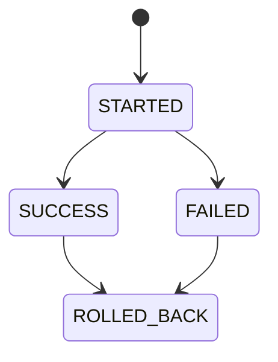

# IRD-001 — Deploy Service Requirements

Local mirror of the Notion page (source of truth): https://app.notion.com/p/3cfb4aef8239813e8537da5ffed83e37

## 1. Decision

1. Deploy Service is the single source of truth for deploy status; no other service writes to `deploy_db`.
2. Deploy status follows a fixed state machine (STARTED → SUCCESS/FAILED → ROLLED_BACK), enforced server-side.
3. Create requests are idempotent on `ci_run_id` — a retry never creates a duplicate record. Satisfies DOP-001 AC-07.
4. Status reads prefer Redis and fall back to PostgreSQL when Redis is unavailable.
5. Writes (POST/PATCH /deploys) always go directly to PostgreSQL — Redis is cache only, never the source of truth for writes.
6. `GET /overview` reads a single Redis cache key (`deploy-service:overview:v1`) with a 30-second TTL; any Redis failure or command timeout falls back to PostgreSQL immediately, with no retry. *(added per TIE-32 / TIE-11)*
7. `ci_run_id` uniqueness (DOP-001 AC-07) is enforced by a database-level UNIQUE constraint on `deploy_db`, not an application-only check — this is what makes idempotency safe under concurrent CI retries. *(added per TIE-32 / TIE-12)*

## 2. Purpose

Deploy Service is the source of truth for deploy status and release history.

## 3. Actors

- CI System
- Engineer
- On-call Engineer
- API Gateway

## 4. Scope

**Covers:** deploy status API, release-flow state machine, `deploy_db` ownership, Deploy Service's communication boundary.
**Does not cover:** API Gateway auth/routing (IRD-003), log storage (IRD-002).

## 5. Service Responsibility

- Owns and updates deploy status according to the release flow.
- Is the only place that answers "which version of service X is running, in which environment, in what status".
- Owns `deploy_db`; no other service reads or writes it directly.

## 6. Release Flow



- A deploy only moves to the next state if it is a valid transition per the diagram above.
- A duplicate create request (CI retry) never creates a new record. Satisfies DOP-001 AC-07.
- Reading the latest status prefers Redis; if Redis fails, it falls back to PostgreSQL.

### 6.1 Overview Cache Policy

*(added per TIE-32, source: TIE-11 implementation)*

| Setting | Value |
|---|---|
| Cache key | `deploy-service:overview:v1` |
| TTL | 30 seconds |
| On Redis failure/timeout | Fall back to PostgreSQL immediately, no retry |
| Invalidation | None on write — relies on the 30s TTL expiry (acceptable given the bound) |

## 7. API

| Method | Path | Purpose | Auth |
|---|---|---|---|
| POST | `/deploys` | CI creates a deploy (idempotent on `ci_run_id`) | API key |
| PATCH | `/deploys/:id` | Update status (only valid transitions allowed) | API key |
| GET | `/deploys` | View deploy history, with filters and pagination | JWT |
| GET | `/deploys/:id` | View a single deploy's details | JWT |
| GET | `/overview` | View the latest status by service/environment (reads Redis, falls back to PG) | JWT |
| GET | `/health` | Health check | None |

**GET `/deploys` query parameters** (added per P1):
- `service` (string) — filter by service name
- `environment` (enum: dev/staging/prod) — filter by environment
- `status` (enum: STARTED/SUCCESS/FAILED/ROLLED_BACK) — filter by status
- `from`, `to` (ISO 8601 timestamps) — filter by created_at range
- `page` (integer, default 1) — page number
- `limit` (integer, default 20, max 100) — items per page

**Response shape:**
```json
{
  "items": [ /* deploy objects */ ],
  "next_cursor": "eyJjcmVhdGVkX2F0Ijoi...",
  "total_count": 137
}
```

**PATCH `/deploys/:id` body:**
```json
{
  "status": "FAILED",
  "reason": "Health check failed after 3 retries"
}
```
`reason` is required when transitioning to FAILED or ROLLED_BACK (per DOP-001 AC-07 context).

## 8. Data Model

| Field | Type |
|---|---|
| `id` | UUID (PK) |
| `service` | string |
| `environment` | enum (dev/staging/prod) |
| `version` | string |
| `status` | enum (STARTED/SUCCESS/FAILED/ROLLED_BACK) |
| `ci_run_id` | string (unique) |
| `reason` | text (nullable) — failure / rollback reason for on-call visibility |
| `created_at` / `updated_at` | timestamp |

`ci_run_id` carries a database-level `UNIQUE` constraint — this is the actual enforcement mechanism for AC-07 idempotency (see Decision #7), not just an application-level check. *(added per TIE-32 / TIE-12)*

## 9. Service Communication Boundary

- Called by: API Gateway.
- Allowed to call: `deploy_db` (PostgreSQL), Redis (read-only for `/overview`).
- Must not call: Log Service, under any circumstance.

## 10. Failure Behavior

If Deploy Service fails, deploy status can't be read or updated; Log Service keeps operating independently.

## 11. User Stories

Acceptance Criteria (AC-xx) live only in DOP-001 §11. The Related DOP AC column below traces each story back to the AC it helps satisfy, where one applies.

| ID | Priority | Given | When | Then | Related DOP AC |
|---|---|---|---|---|---|
| US-DS-01 | High | CI has just started deploying a service | CI notifies Deploy Service | the system records the deploy in the started state | AC-01 |
| US-DS-02 | High | A deploy record already exists for the same CI run | CI sends the same information again | the system does not create a new record | AC-07 |
| US-DS-03 | Medium | An Engineer needs to see recent deploys | the Engineer looks up deploy history (with filters) | the system returns the filtered list of deploys, newest first | — |
| US-DS-04 | High | A production incident is in progress | the on-call engineer checks the latest deploy status | the system reports the service, environment, version, status, and failure reason if any | — |

## 12. Definition of Done

| # | Criterion |
|---|---|
| 1 | POST `/deploys` creates a record; a duplicate `ci_run_id` never creates a second record (DOP-001 AC-07) |
| 2 | PATCH `/deploys/:id` only accepts transitions that are valid per the release flow state diagram; `reason` is required for FAILED and ROLLED_BACK |
| 3 | GET `/overview` reads from Redis and falls back to PostgreSQL when Redis is down |
| 4 | GET `/deploys` supports all query parameters and returns paginated results with `next_cursor` and `total_count` |
| 5 | The Deploy Service container passes its health check in the Compose stack |
| 6 | All four user stories above are verified with tests |

## 13. Impact

Any service that wants deploy status visibility must go through API Gateway → Deploy Service; it must never read `deploy_db` directly or query another service's database.
